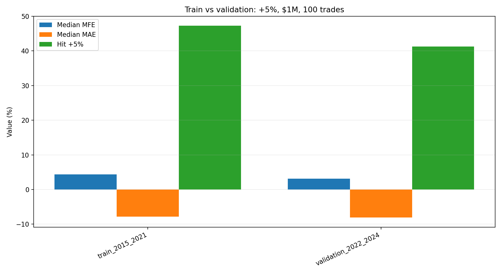

# 短线动量策略研究

[English](README_EN.md) | 中文

一个针对美股盘前动量的实证研究项目。它研究一个明确的问题：**一只股票在 T 日进入涨幅前 50，并在下一交易日开盘前确认动量后，是否仍有可观的上涨空间？**

本仓库覆盖完整研究流程：用 CRSP 日线数据构建股票池、处理 TAQ 逐笔成交、分析事件驱动信号、模拟入场与退出、进行时间序列验证，以及开展避免前视偏差的 LightGBM 策略选择实验。

> 本仓库仅用于研究和回测，不构成投资建议，也不代表一套可投入实盘的交易策略。

## 研究概览

最新事件研究使用 `04:00–09:30` 的普通股 TAQ 逐笔成交，而不是固定时间窗口近似。

**候选股票池**

- 按单日收益率排名的 T 日涨幅前 50
- 市值在 `$300M` 至 `$5B` 之间

**盘前触发条件**

- 价格至少高于 T 日收盘价 `5%`
- 累计盘前成交额至少 `$1M`
- 累计成交笔数至少 `100`

**2015–2024 年样本结果**

| 指标 | 结果 |
| --- | ---: |
| 候选事件数 | 3,402 |
| 触发事件数 | 2,291 |
| 触发覆盖率 | 67.3% |
| 触发时间中位数 | 07:56 |
| 至当天最高价的最大有利波动中位数 | +4.03% |
| 达到 +5% 的概率 | 45.13% |
| 至当天最低价的最大不利波动中位数 | -7.92% |



该信号能识别出当天往往仍有上行空间的股票，但其不利波动也很大。因此，证据**不支持**在触发时直接追高；执行方式、仓位管理和退出设计仍是核心研究问题。

## 机器学习实验

[`ml_strategy_lab`](ml_strategy_lab/) 使用触发时刻之前已知的信息，评估模型能否在分批回踩入场和多种风险管理模板之间进行选择。

- 每个事件只在触发时刻做一次决策，所有特征均按该时刻截取。
- 模型使用 `2015–2021` 年数据训练，使用 `2022–2024` 年数据验证。
- 完整实验包含 2,291 个事件和 20,619 条“事件—策略”观测。
- 验证集风险模型 AUC：`0.8310`。
- 验证集收益模型 MAE：`0.018615`。
- 选择器在 812 个验证事件中选择入场 311 次。

结果也如实保留了不足：各验证年份的收益不稳定，累计收益序列的回撤代理值为 `-53.72%`，事件平均收益的 bootstrap 95% 区间跨过零。这是一条有用的研究基线，而不是可部署收益优势的证据。

实验设计、策略网格和完整基线结果见 [`ml_strategy_lab/README.md`](ml_strategy_lab/README.md)。

## 研究流程

```text
CRSP 日线数据
    -> 排名 T 日涨幅并构建候选股票池
TAQ 盘前逐笔成交（04:00–09:30）
    -> 逐笔回放累计价格、成交额和成交笔数条件
触发事件
    -> 测量有利/不利路径并模拟入场和退出模板
时点特征 + 已实现策略结果
    -> 使用 2015–2021 年训练，使用 2022–2024 年验证
```

## 项目结构

```text
data/wrds/
  preprocess.py                         # CRSP 下载与日线特征处理
  preprocess_premarket.py               # TAQ 盘前聚合辅助函数

tester/
  run_screen.py                         # T 日涨幅榜筛选
  analyze_full_premarket_dynamic_triggers.py
                                         # 逐笔回放 04:00–09:30 触发条件
  analyze_high_coverage_entries.py       # 固定与回踩入场分析
  analyze_staged_entries.py              # 分批入场分析
  generate_research_summary_report.py    # 生成最终报告和图表

ml_strategy_lab/
  configs/                               # 策略网格与模型配置
  scripts/                               # 数据集构建与 LightGBM 流程

docs/reports/premarket_strategy_summary/
                                         # 研究报告、PDF 与图表
```

大型原始数据、TAQ 缓存、凭据和本地生成结果均有意排除在版本控制之外。

## 复现分析

项目使用 Python、pandas、NumPy、Matplotlib、scikit-learn、LightGBM 和 WRDS。请在仓库根目录运行以下命令。

生成最终研究总结和图表：

```powershell
python tester\generate_research_summary_report.py
```

运行逐笔动态触发分析：

```powershell
python tester\analyze_full_premarket_dynamic_triggers.py `
  --input screen_results\20150102_20241231_gainers_return_1d_top50\premarket\premarket_enriched_results.csv `
  --progress-every 100
```

运行机器学习流程：

```powershell
python ml_strategy_lab\scripts\02_build_strategy_grid.py
python ml_strategy_lab\scripts\03_build_event_features.py
python ml_strategy_lab\scripts\04_build_model_dataset.py
python ml_strategy_lab\scripts\05_train_lightgbm.py
```

机器学习流程可使用现有本地 `04:00–09:30` TAQ 缓存。可在前两个脚本中使用 `--max-dates` 进行快速 smoke test。

## 数据访问

原始研究管线通过 WRDS 访问 CRSP 和 TAQ 数据，这些数据不能在本仓库中重新分发。本地凭据可以放入被 Git 忽略的 `.env` 文件：

```text
WRDS_USERNAME=...
WRDS_PASSWORD=...
```

## 已知局限与下一步

- 加入交易成本、滑点、流动性约束和更真实的成交假设。
- 用考虑资金占用的投资组合回测替代回撤代理指标。
- 扩展滚动向前验证和市场环境分层验证。
- 测试触发后的回踩、重新突破、VWAP 区域和分批入场。
- 开发明确的止损、分批止盈、移动止损和按市值分配仓位的规则。

详细中文研究报告提供 [Markdown](docs/reports/premarket_strategy_summary/premarket_strategy_research_summary_zh.md) 和 [PDF](docs/reports/premarket_strategy_summary/premarket_strategy_research_summary_zh.pdf) 两种格式。
