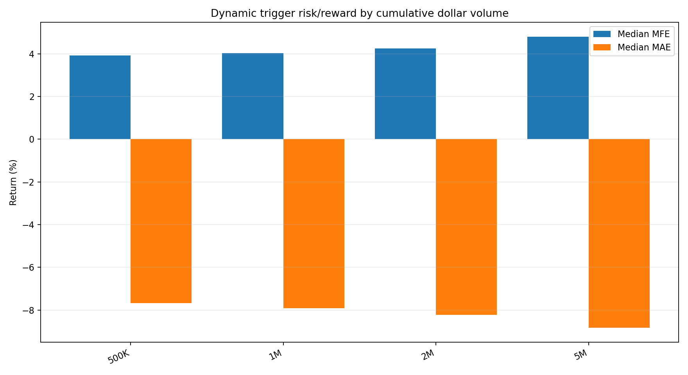
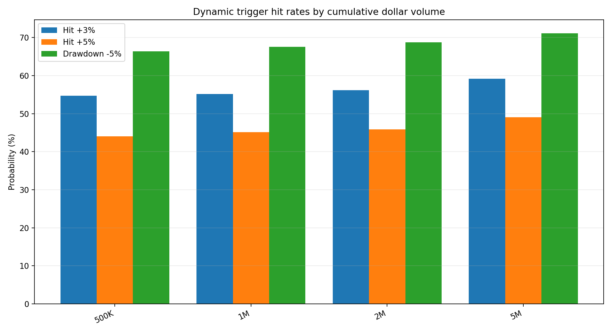
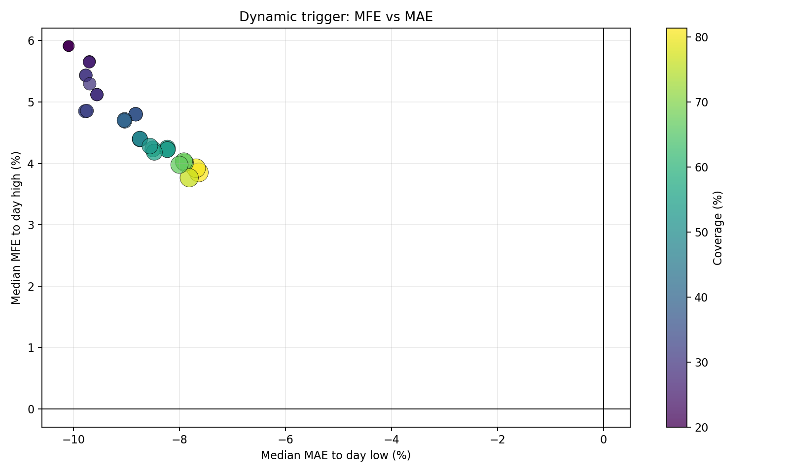
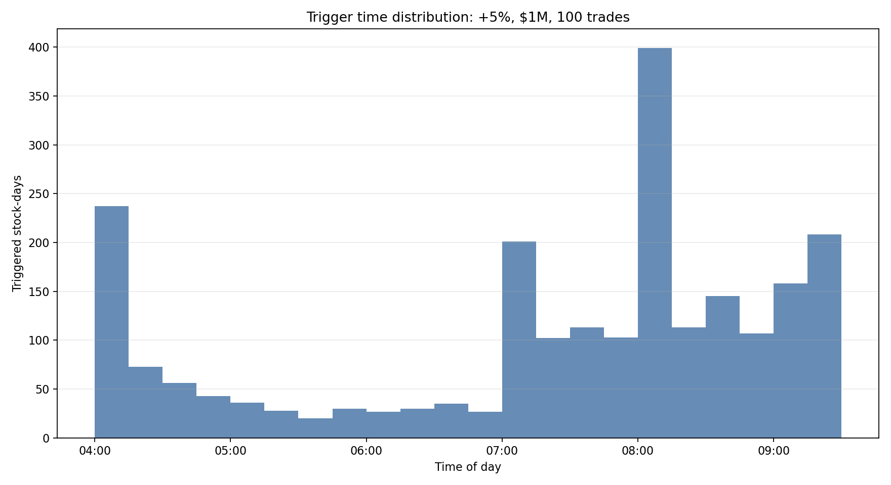
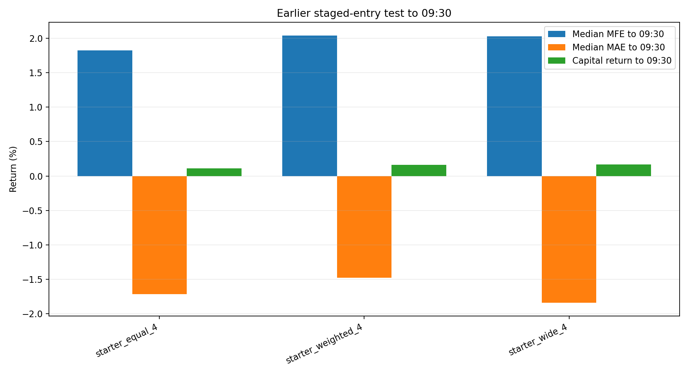

# 盘前动量策略研究总结

本文档汇总当前项目里已经完成的筛选、盘前信号、动态触发和入场研究。核心目标不是证明固定持有收益，而是判断：T 日大涨股在下一交易日盘前出现动量后，是否仍有足够的当天上冲空间，以及下一步策略开发应该从哪里开始。

## 最终候选方向

- 股票池：T 日涨幅前 50。
- 市值：300M-5B。300M-1B 的空间更大，但样本太少；300M-5B 更适合先开发通用策略，再按市值控制仓位。
- 动态信号：04:00-09:30 任意普通股成交触发，不使用固定窗口。
- 基准触发：相对 T 日收盘价上涨至少 5%，累计盘前成交额至少 1M，累计成交笔数至少 100。
- 交易假设：触发后不直接追高满仓，而是进入观察状态，等待回踩、承接或重新突破后分批入场。

## 基准动态触发结果

| trigger_floor | min_cum_dollar_volume | min_cum_trade_count | candidate_count | trigger_count | coverage | median_trigger_time | median_trigger_return | median_mfe_to_day_high | p_mfe_3 | p_mfe_5 | p_mfe_10 | median_mae_to_day_low | p_mae_5 | trimmed_to_close |
| --- | --- | --- | --- | --- | --- | --- | --- | --- | --- | --- | --- | --- | --- | --- |
| 5.00% | 1M | 100 | 3402 | 2291 | 67.34% | 07:56:50 | +5.97% | +4.03% | 55.13% | 45.13% | 26.10% | -7.92% | 67.53% | -2.45% |
| 5.00% | 5M | 100 | 3402 | 1248 | 36.68% | 08:00:05 | +7.14% | +4.80% | 59.13% | 49.04% | 29.65% | -8.83% | 71.15% | -2.82% |

解读：`>=5%, >=1M, >=100 trades` 覆盖率足够高，触发后到当天最高点的中位 MFE 约 4%，达到 +5% 的概率约 45%。但中位 MAE 接近 -8%，说明信号只证明“今天有波动空间”，不证明可以直接买入。

## 训练期与验证期

| period | trigger_count | median_trigger_time | median_trigger_return | median_mfe_to_day_high | p_mfe_3 | p_mfe_5 | p_mfe_10 | median_mae_to_day_low | p_mae_5 | trimmed_to_close |
| --- | --- | --- | --- | --- | --- | --- | --- | --- | --- | --- |
| train_2015_2021 | 1479 | 07:57:20 | +6.33% | +4.36% | 57.61% | 47.26% | 27.45% | -7.82% | 66.33% | -2.44% |
| validation_2022_2024 | 812 | 07:55:26 | +5.50% | +3.11% | 50.62% | 41.26% | 23.65% | -8.10% | 69.70% | -2.48% |

验证期 2022-2024 的 MFE 明显低于训练期，但仍保留约 3% 的中位冲高空间，+5% 命中率约 41%。这说明策略不能依赖旧市场环境里的极端波动，必须靠入场价格和止损结构改善盈亏比。

## 为什么之前 09:30 版本看起来很差

之前的 staged-entry 测试只看到 09:30，等于只看开盘瞬间。完整盘前动态触发后到当天最高点的 MFE 显著更大，说明很多上冲发生在 09:30 之后。策略方向应从“盘前触发后开盘前必须冲高”改为“盘前确认能量后，捕捉当天盘中冲高”。

| rule | entry_count | avg_invested_fraction | full_position_rate | trimmed_capital_return_0930 | median_mfe_0930 | median_mae_0930 |
| --- | --- | --- | --- | --- | --- | --- |
| starter_equal_4 | 1004 | 56.97% | 23.21% | +0.11% | +1.82% | -1.72% |
| starter_weighted_4 | 1004 | 44.27% | 23.21% | +0.16% | +2.04% | -1.48% |
| starter_wide_4 | 1004 | 25.74% | 7.67% | +0.17% | +2.03% | -1.84% |

## 入场研究的保留结论

| method | entry_count | median_mfe_0930 | median_mae_0930 | p_hit_up_3pct | p_hit_up_5pct | trimmed_return_0930 |
| --- | --- | --- | --- | --- | --- | --- |
| fixed_080100 | 1004 | +1.66% | -2.49% | 30.78% | 16.43% | -0.15% |
| fixed_090000 | 1004 | +0.90% | -1.36% | 12.95% | 4.48% | -0.15% |
| pb2_fallback_090000 | 1004 | +1.32% | -1.60% | 21.71% | 9.86% | +0.14% |

固定时间直接买入不适合做最终方案。早买有更大 MFE，但 MAE 也更深；晚买回撤较小但空间变窄。因此下一步应开发触发后的动态入场：回踩买、重新突破买、分批买，再配合移动止损。

## 下一步策略开发

1. 使用完整逐笔盘前触发结果作为信号层：`>=5%, >=1M, >=100 trades`。
2. 触发后测试入场层：首次回踩 1%-3%、VWAP 附近承接、重新突破触发价、分批加仓。
3. 测试退出层：+3%/+5% 分批止盈，-2%/-3% 初始止损，盈利后保本，最高价回撤 1%-2% 移动止损。
4. 分市值控制仓位：300M-1B 波动空间更大但仓位更小；1B-5B 可以承担稍大仓位但预期空间更低。
5. 所有最终策略必须用逐笔路径判断止盈止损谁先发生，不能只用当天 high/low。

## 文件来源

- 完整逐笔动态触发：`screen_results/.../full_premarket_dynamic_triggers/`。
- 分批入场早期测试：`screen_results/.../staged_entry_analysis/`。
- 高覆盖入场测试：`screen_results/.../high_coverage_entry_analysis/`。
- 本报告图表由 `tester/generate_research_summary_report.py` 生成。